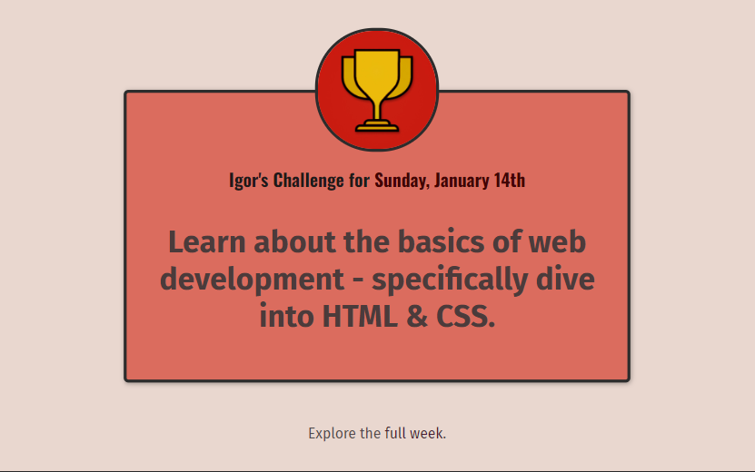

# web-development-complete

## Stack utilizada

**Front-end:**   

<h2>Sobre:</h2>

Primeiro projeto desenvolvido no curso <a href="https://www.udemy.com/course/100-days-of-code-web-development-bootcamp/" target="_blank">100 Days Of Code - 2024 Web Development Bootcamp</a>, onde eu pude aprender e praticar bastante os fundamentos de HTML e CSS.

<h2>Link: <a href="https://igorgazineo.github.io/web-development-complete/" target="_blank">Acessar o projeto</a>.</h2>
